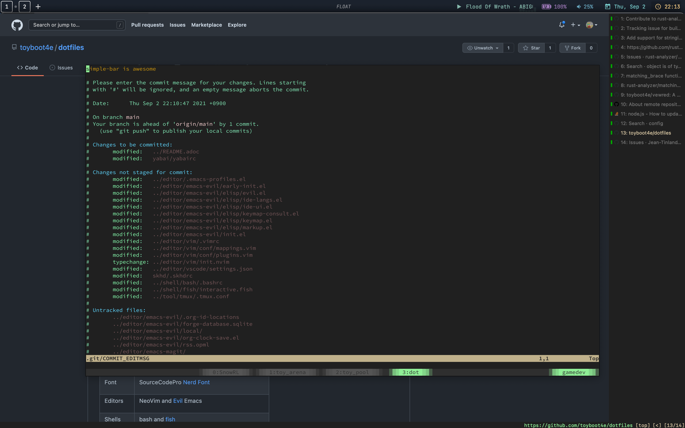

= dotfiles
:nix: https://github.com/NixOS/nix[Nix]
:hm: https://github.com/nix-community/home-manager[Home Manager]
:brew: https://brew.sh/[Homebrew]

:kitty: https://sw.kovidgoyal.net/kitty/[Kitty]
:tmux: https://github.com/tmux/tmux[tmux]
:nerd: https://github.com/ryanoasis/nerd-fonts[Nerd Font]
:evil: https://github.com/emacs-evil/evil[Evil]
:fish: https://fishshell.com/[fish]

:qb: https://qutebrowser.org/[qutebrowser]
:w3m: http://w3m.sourceforge.net/[w3m]

:skhd: https://github.com/koekeishiya/skhd[skhd]
:yabai: https://github.com/koekeishiya/yabai[yabai]
:karabiner: https://karabiner-elements.pqrs.org/[Karabiner-Elements]
:simple-bar: https://github.com/Jean-Tinland/simple-bar[simple-bar]
:uber: https://github.com/felixhageloh/uebersicht[Übersicht]
// :spacebar: https://github.com/somdoron/spacebar[spacebar]

:i3: https://github.com/i3/i3[i3]
:flameshot: https://github.com/flameshot-org/flameshot[flameshot]

:ghq: https://github.com/x-motemen/ghq[ghq]
:gh: https://github.com/cli/cli[gh]
:rg: https://github.com/BurntSushi/ripgrep[ripgrep]
:hgrep: https://github.com/rhysd/hgrep[hgrep]
:fd: https://github.com/sharkdp/fd[fd]
:as-tree: https://github.com/jez/as-tree[as-tree]
:bat: https://github.com/sharkdp/bat[bat]
:exa: https://github.com/ogham/exa[exa]
:delta: https://github.com/delta-io/delta[delta]

:xdg-ninja: https://github.com/b3nj5m1n/xdg-ninja[xdg-ninja]

I followed the cool https://github.com/koekeishiya/dotfiles[dotfiles] for colors.



== List

See link:nixos[nixos/] for the complete list. I'm switcing to Nix from {brew}.

|===
| Terminal | {kitty} with {tmux}
| Font     | SourceCodePro ({nerd})
| Editors  | NeoVim and {evil} Emacs
| Shells   | bash and {fish}
| Browsers | {qb}, firefox and {w3m}
| macOS    | {yabai}, {skhd}, {simple-bar} and {karabiner}
| Linux    | X11, {i3}, {flameshot}
|===

{ghq}, {gh}, {rg}, {hgrep}, {fd}, {as-tree}, {bat}, {exa}, {delta}, GNU sed, GNU xargs and `rename`

== Installations (WIP)

=== macOS

See link:nixos[nixos/] for most packages.

I fail to install some packages with {nix} (somehow), so I'm using {brew} for them:

```sh
$ brew install kitty
$ brew install --cask qutebrowser
$ brew install emacs-plus --with-no-titlebar
$ brew install ccls node make cmake llvm
$ brew install bandcamp-dl
```

macOS-only:

```sh
$ brew install yabai skhd
$ brew install --cask karabiner-elements
```

{simple-bar} and {uber}

=== NixOS

I'm still unfamilar with that OS!

=== Windows

I'm still unfamilar with that OS!

== Misc

- If you're on Linux, try {xdg-ninja} to check if your configuration files are placed correctly

