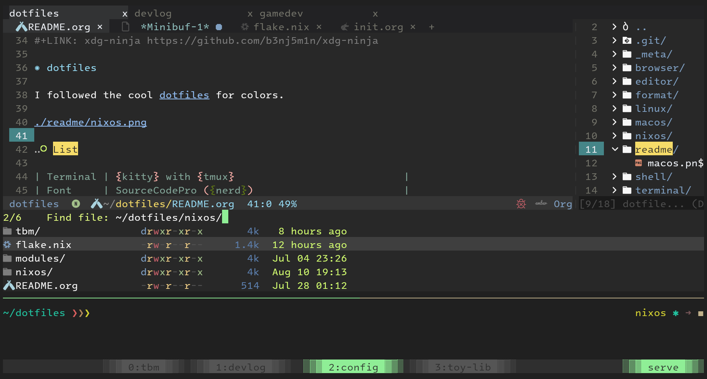
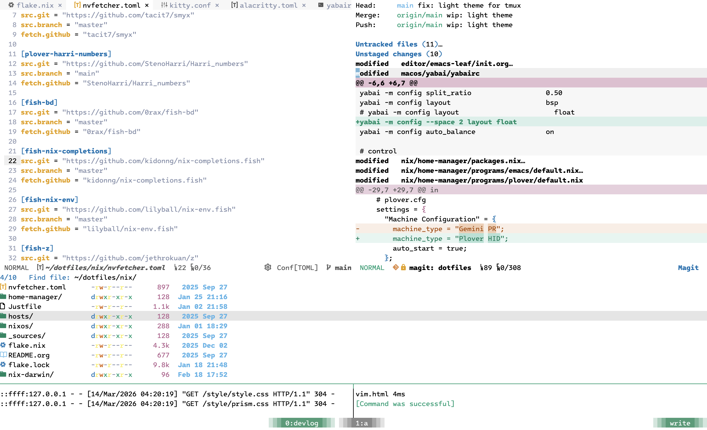

# dotfiles

This is a set configuration files for NixOS and macOS.

## Colors

I followed the cool [dotfiles](https://github.com/koekeishiya/dotfiles) for colors.

I'm interested in transparent terminals thesedays:

I'm also interested in light themes:

## List

These are the tools frequently used:

| Item         | What I use |
|--------------|------------|
| Terminals    | [alacritty](https://alacritty.org/) or [kitty](https://sw.kovidgoyal.net/kitty/) with [tmux](https://github.com/tmux/tmux) |
| Fonts        | Intel One Mono ([nerd font](https://github.com/ryanoasis/nerd-fonts)) |
| Editors      | [Evil](https://github.com/emacs-evil/evil) Emacs |
| Shells       | bash and [fish](https://fishshell.com/) |
| Browsers     | [qutebrowser](https://qutebrowser.org/), firefox and [w3m](http://w3m.sourceforge.net/) |
| Task runners | [just](https://github.com/casey/just) |
| Git          | [ghq](https://github.com/x-motemen/ghq), [gh](https://github.com/cli/cli), [delta](https://github.com/delta-io/delta) |
| Grep         | [rg](https://github.com/BurntSushi/ripgrep), [hgrep](https://github.com/rhysd/hgrep) |
| File         | [fd](https://github.com/sharkdp/fd), [as-tree](https://github.com/jez/as-tree), [bat](https://github.com/sharkdp/bat), [eza](https://github.com/eza-community/eza), [ranger](https://github.com/ranger/ranger) |
| macOS        | [AeroSpace](https://github.com/nikitabobko/AeroSpace), [SwipeAeroSpace](https://github.com/MediosZ/SwipeAeroSpace), [SketchyBar](https://github.com/FelixKratz/SketchyBar) and [karabiner](https://karabiner-elements.pqrs.org/) |
| Linux        | X11, [i3](https://github.com/i3/i3), [sxhkd](https://github.com/baskerville/sxhkd), [flameshot](https://github.com/flameshot-org/flameshot) |
| Misc         | GNU sed, GNU `rename` |

## Installations

Today I'm making symlinks one by one (dear..). I should migrate to `home-manager` land of configuration files.

## Misc

- [xdg-ninja](https://github.com/b3nj5m1n/xdg-ninja)
